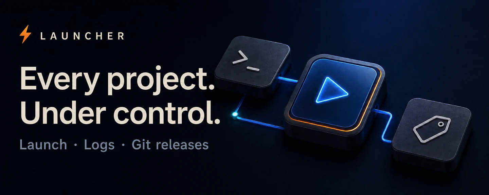
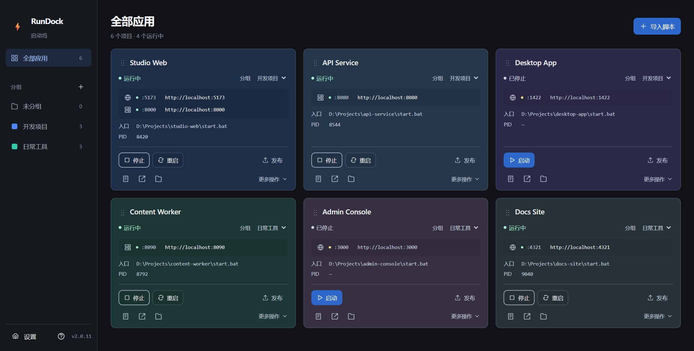
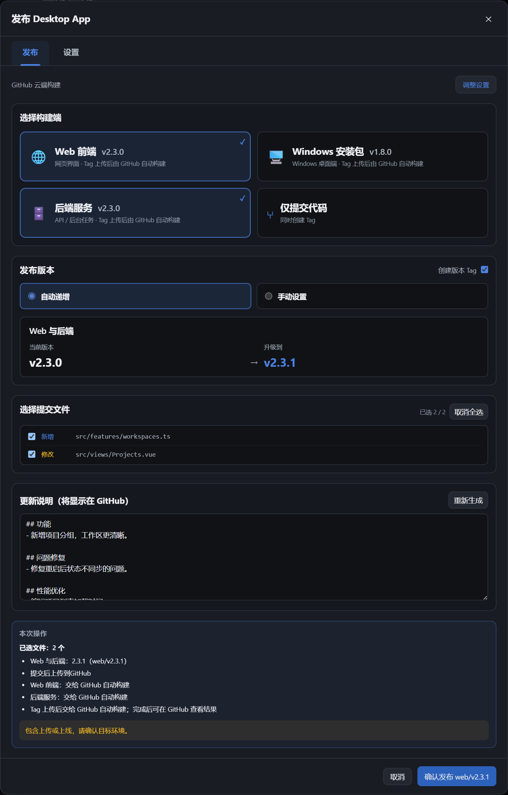

<a href="./README.md">简体中文</a> · <strong>English</strong>

  

<strong>A Windows project manager for script control, live logs, and Git releases.</strong>

  

<a href="./docs/guide.en.md">User guide</a> · <a href="https://github.com/oooing/projects-start-manager/actions/workflows/release.yml">Build status</a> · <a href="https://github.com/oooing/projects-start-manager/issues">Feedback</a>

 

## Less terminal juggling. More control.

Drop in a startup script. Get a project card. Find controls, logs, and service URLs in one place.

  

Actual interface · Demo data · UI shown in Chinese · Click to enlarge

| One-click control | Instant visibility | Organized releases |
| :--- | :--- | :--- |
| Start, stop, and restart from one place. | Live logs, ports, and service URLs at a glance. | Select files, set versions, and review notes. |

 

## Web today. Desktop tomorrow. Your call.

Mix configured targets or just commit code. **Tags are optional. Version groups can advance independently.**

  

Actual interface · Demo configuration; each project needs its own build and deployment setup.

Launcher's Windows installers are built in the cloud with **GitHub Actions**. After pushing, follow the progress link to check the build and release.

 

## Three steps to get going

**① Install Launcher　→　② Drop in a script　→　③ Hit Start**

Works with `.bat` · `.cmd` · `.ps1`. Keep the startup scripts you already use.

> Windows 10/11 x64 · Installers are unsigned and may trigger SmartScreen warnings. Verify the download source and checksums.

Scope and data safety

- Drag-and-drop works in the desktop app; browser development mode imports full paths.
- A successful push is not a completed cloud build. Publishing a Release does not update installed clients automatically.
- Git uses existing system credentials. No GitHub passwords or personal tokens are stored. Project diagnostics stay local by default; check for sensitive data before sharing.
- Scripts execute local code. Only run projects you trust.

---

<strong>More time for the project itself.</strong>

<a href="https://github.com/oooing/projects-start-manager/releases">Get Launcher</a> · <a href="./docs/guide.en.md#local-development">Build from source</a>

Tauri 2 · Vue 3 · Go · SQLite

