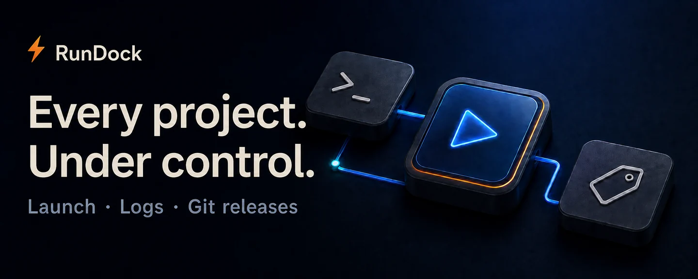

<a href="./README.md">简体中文</a> · <strong>English</strong>

<h1 align="center">RunDock</h1>

  

<strong>A Windows launcher that makes AI-built tools and dev projects easier to manage.</strong>

  

<a href="./docs/guide.en.md">User guide</a> · <a href="https://github.com/oooing/rundock/actions/workflows/release.yml">Build status</a> · <a href="https://github.com/oooing/rundock/issues">Feedback</a>

 

## Less terminal juggling. More control.

AI makes building tools easier. But many still start with `start.bat` or `run.bat`—no installer, no convenient shortcut.

- **AI-built tools and one-off scripts**: no installer to build. Drop in a startup script and get a project card you can launch with a click.
- **Several tools running at once**: scripts run in the background without a desktop full of look-alike console windows. Read each project's logs separately.
- **Multiple projects to maintain**: organize them into groups, start or restart with a click, and manage status, service URLs, and Git releases in one place.

  

Actual interface · Demo data · UI shown in Chinese · Click to enlarge

 

## Focus on the release. Keep settings separate.

Choose targets, versions, files, and notes in **Release**. Build methods and project configuration live in **Settings**.

- **Targets with their current versions**: select configured Web, Windows, server, and other targets, or just commit code.
- **See the version change clearly**: a separate version card shows **current → target**, with automatic increments or manual input. Targets sharing a version are edited together.
- **Draft notes, then review**: generate a short draft from code changes and edit it before submitting.

  

Actual interface · Demo configuration; each project needs its own build and deployment setup.

Projects default to **GitHub cloud builds**, with a local build option in **Settings**. Cloud builds require a matching GitHub Actions workflow in the project. After code and tags are uploaded, follow the progress link to check the actual build result.

View Settings: build location, uploads, and configuration files

  

Open the configuration example for an annotated reference, or open the current project's file to edit, validate, and save it. [See the steps](./docs/guide.en.md#releasing-a-project).

 

## Three steps to get going

**① Install RunDock　→　② Add project　→　③ Hit Start**

Choose a `.bat`, `.cmd`, or `.ps1` startup script, or select a project folder and let RunDock discover its startup method. Confirm to create a project card. [Adding a project](./docs/guide.en.md#getting-started).

> Windows 10/11 x64 · Installers are unsigned and may trigger SmartScreen warnings. Verify the download source and checksums.

> Upgrading from Launcher: MSI retains the upgrade identity. EXE users should uninstall the old Launcher while keeping application data, then install RunDock. Project data paths are unchanged.

Scope and data safety

- Drag-and-drop works in the desktop app; browser development mode imports full paths.
- A successful push is not a completed cloud build. Publishing a Release does not update installed clients automatically.
- Git uses existing system credentials. No GitHub passwords or personal tokens are stored. Project diagnostics stay local by default; check for sensitive data before sharing.
- Scripts execute local code. Only run projects you trust.

---

<strong>More time for the project itself.</strong>

<a href="https://github.com/oooing/rundock/releases">Get RunDock</a> · <a href="./docs/guide.en.md#local-development">Build from source</a>

Tauri 2 · Vue 3 · Go · SQLite

