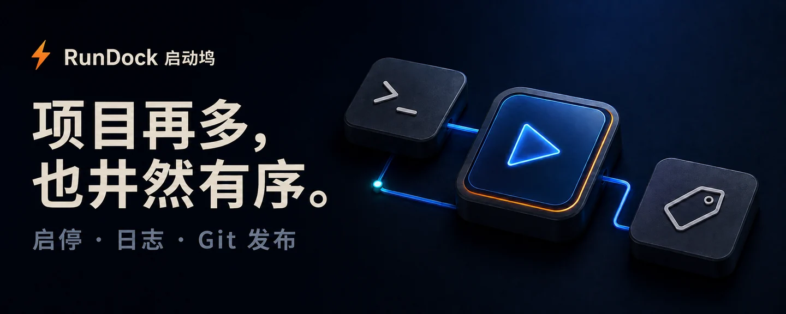
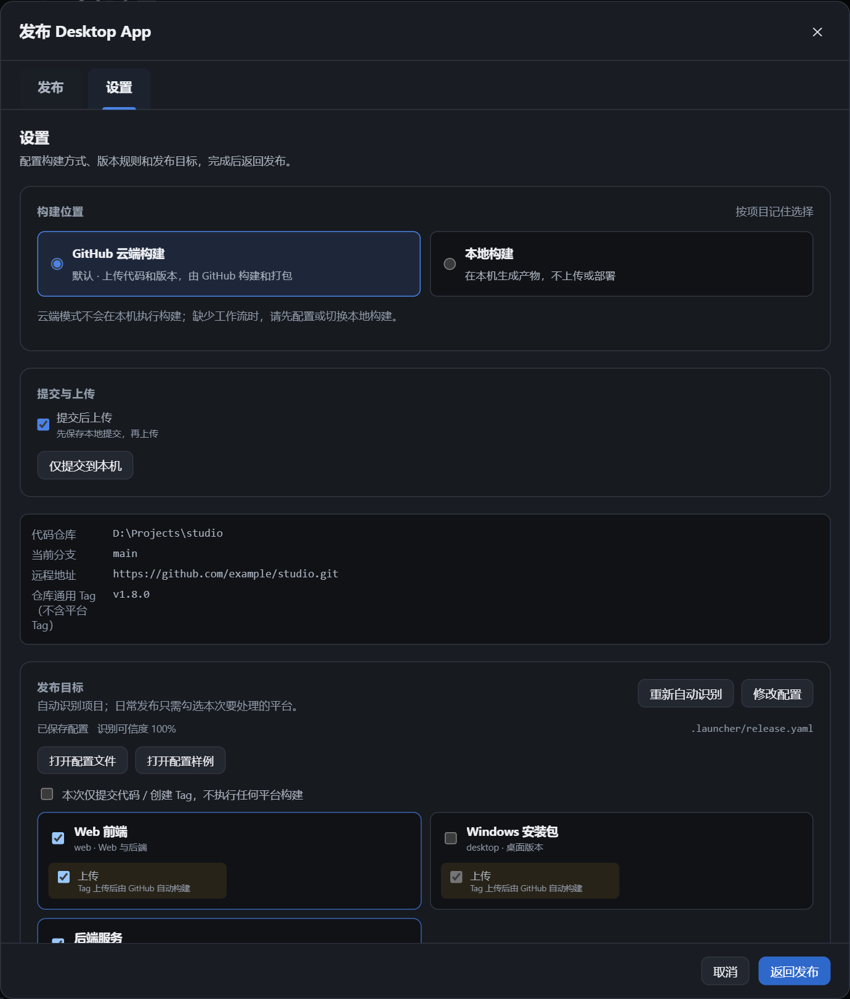

<strong>简体中文</strong> · <a href="./README.en.md">English</a>

<h1 align="center">RunDock 启动坞</h1>

  

<strong>Windows 项目启动器，让 AI 小工具和开发项目像应用一样好管理。</strong>

  

<a href="./docs/guide.zh-CN.md">使用指南</a> · <a href="https://github.com/oooing/rundock/actions/workflows/release.yml">构建进度</a> · <a href="https://github.com/oooing/rundock/issues">反馈建议</a>

 

## 告别散落的脚本和终端

AI 让写工具越来越容易，但很多工具仍靠 `start.bat`、`run.bat` 启动，没有安装包和快捷入口。

- **AI 写的小工具、临时脚本**：不用制作安装包，拖入启动脚本，就有固定的项目卡片，一点即开。
- **同时运行多个工具**：脚本后台运行，不让难以区分的黑窗口堆满桌面；每个项目的日志单独查看。
- **自己维护多个项目**：按组管理，一键启停与重启，运行状态、服务地址和 Git 发布集中管理。

  

真实界面 · 示例数据 · 点击查看大图

 

## 发布更专注，设置单独管理

在「发布」中选端、改版本、勾文件、写更新说明；构建方式和项目配置集中在「设置」。

- **端与当前版本放在一起**：选择 Web、Windows、服务端等已配置目标，也可以仅提交代码。
- **升级到哪个版本，一眼看清**：独立的「发布版本」卡片展示 **当前版本 → 目标版本**，支持自动递增与手动设置；共用版本的端统一修改。
- **更新说明先生成，再修改**：根据代码变更生成简短初稿，确认后随版本提交。

  

真实界面 · 示例配置；各项目的构建与部署流程需单独配置。

每个项目默认使用 **GitHub 云端构建**，在「设置」中可切换为本地构建。云端模式需要项目已配置匹配的 GitHub Actions 工作流；代码和 Tag 上传后，点击进度链接查看实际构建结果。

查看「设置」：构建位置、上传选项与配置文件

  

「打开配置样例」查看带说明的示例；「打开配置文件」查看、编辑并校验保存当前项目的配置。[查看操作步骤](./docs/guide.zh-CN.md#git-发布怎么用)。

 

## 三步，开始管理

**① 安装 RunDock　→　② 添加项目　→　③ 点击启动**

选择 `.bat` · `.cmd` · `.ps1` 启动脚本，或选择整个项目文件夹，让 RunDock 识别启动方式。确认后生成项目卡片。[查看添加步骤](./docs/guide.zh-CN.md#开始使用)。

> Windows 10/11 x64 · 安装包未签名，可能触发 SmartScreen 提示；请核对下载来源与校验和。

> 原 Launcher 用户：MSI 可沿用升级标识；EXE 安装用户请先卸载旧 Launcher，保留应用数据，再安装 RunDock。项目数据目录未改变。

使用边界与数据安全

- 桌面端支持拖入文件；浏览器开发模式使用完整路径导入。
- 推送成功不等于云端构建完成；发布 Release 不会自动更新已安装的客户端。
- Git 使用系统现有凭据，不保存 GitHub 密码或个人 Token。项目诊断日志默认保存在本地，分享前请检查敏感信息。
- 脚本会执行本机代码，请只运行可信项目。

---

<strong>把时间留给项目本身。</strong>

<a href="https://github.com/oooing/rundock/releases">下载 RunDock</a> · <a href="./docs/guide.zh-CN.md#本地开发">参与开发</a>

Tauri 2 · Vue 3 · Go · SQLite

