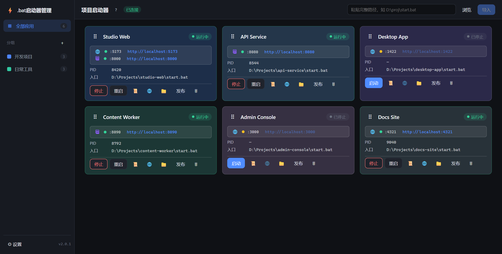
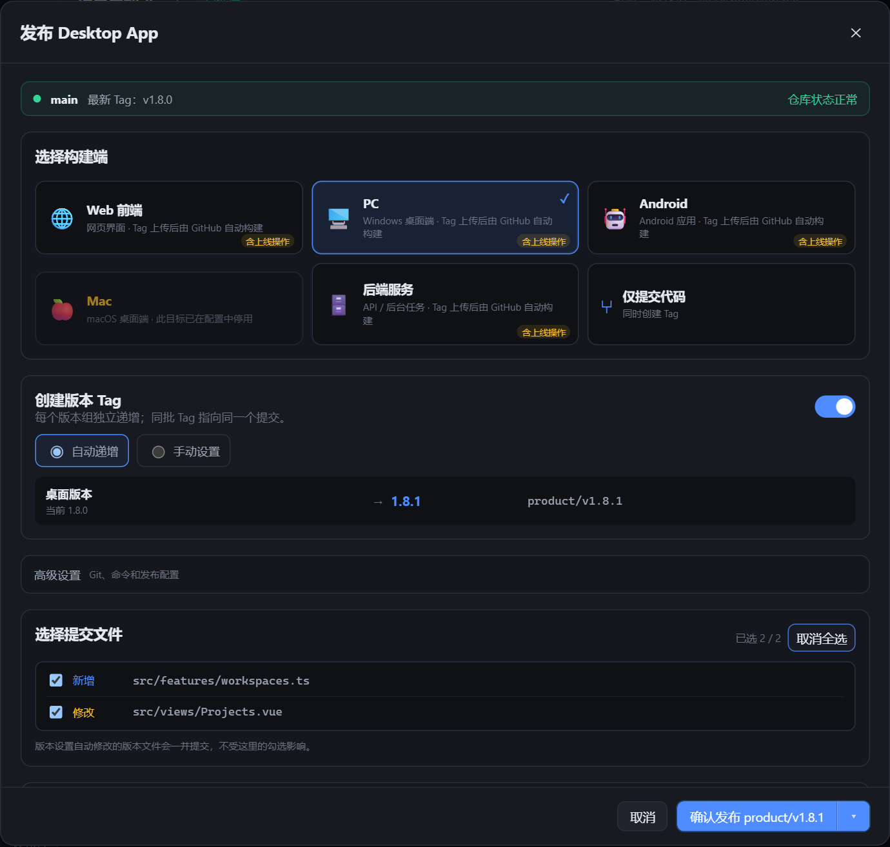

<strong>简体中文</strong> · <a href="./README.en.md">English</a>

  

<strong>Windows 项目管理工具，把脚本启停、运行日志和 Git 发布放在一起。</strong>

  

<a href="./docs/guide.zh-CN.md">使用指南</a> · <a href="https://github.com/oooing/projects-start-manager/actions/workflows/release.yml">构建进度</a> · <a href="https://github.com/oooing/projects-start-manager/issues">反馈建议</a>

 

## 告别散落的脚本和终端

拖入启动脚本，让每个项目都有自己的卡片。启停、日志、服务地址，不用来回找。

  

真实界面 · 示例数据

| 一键启停 | 状态可见 | 发布有序 |
| :--- | :--- | :--- |
| 启动、停止、重启，集中操作。 | 实时日志、端口、服务地址，一眼找到。 | 选文件、定版本、写说明，按配置发布。 |

 

## 这次发 Web，下次发 PC。由你决定。

按需组合发布目标，也可以仅提交代码。**Tag 可选，版本可独立管理。**

  

真实界面 · 示例配置；各项目的构建与部署流程需单独配置。

Launcher 自身的 Windows 安装包交给 **GitHub Actions 云端构建**。代码上传后，可跳转查看打包与发布进度。

 

## 三步，开始管理

**① 安装 Launcher　→　② 拖入项目脚本　→　③ 点击启动**

支持 `.bat` · `.cmd` · `.ps1`。不需要改变项目现有的启动方式。

> Windows 10/11 x64 · 安装包未签名，可能触发 SmartScreen 提示；请核对下载来源与校验和。

使用边界与数据安全

- 桌面端支持拖入文件；浏览器开发模式使用完整路径导入。
- 推送成功不等于云端构建完成；发布 Release 不会自动更新已安装的客户端。
- Git 使用系统现有凭据，不保存 GitHub 密码或个人 Token。项目诊断日志默认保存在本地，分享前请检查敏感信息。
- 脚本会执行本机代码，请只运行可信项目。

---

<strong>把时间留给项目本身。</strong>

<a href="https://github.com/oooing/projects-start-manager/releases">下载 Launcher</a> · <a href="./docs/guide.zh-CN.md#本地开发">参与开发</a>

Tauri 2 · Vue 3 · Go · SQLite

