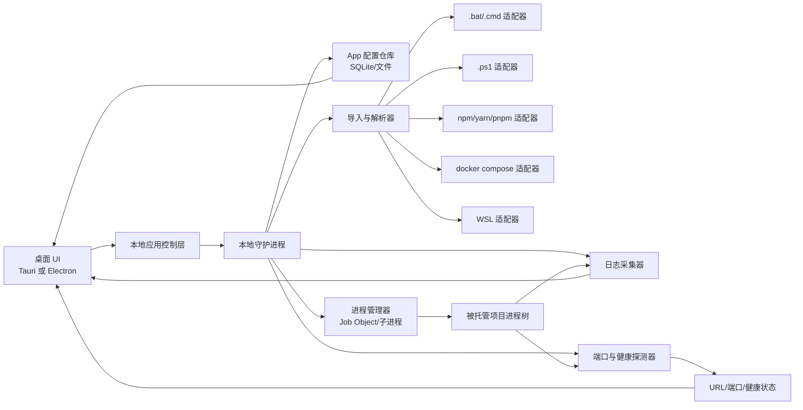
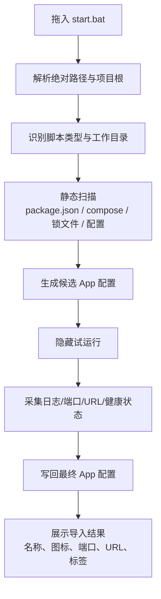
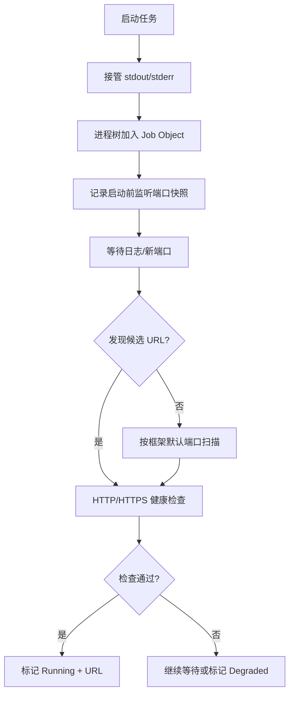
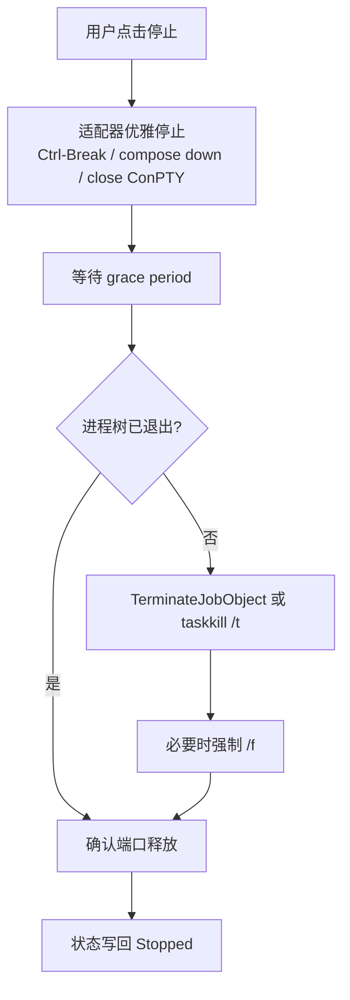

# Windows AI 启动平台深度研究报告

> 历史研究资料，由原项目外层文档归档而来，不是当前功能或实施要求。原文中的工具引用标记未完整导出，不能作为可点击来源；实施前须重新核实相关结论。

## 执行摘要

结论先行：你要做的这个“AI 启动平台”在 Windows 上**完全可做**，而且很适合做成一个以“拖入 `start.bat` 即可接管”为核心体验的本地桌面工具。Windows 提供了足够的底层能力来做到：隐藏控制台窗口启动脚本、捕获标准输出、追踪进程树、在端口层面发现服务、在需要时做强制终止；Node、Python、Go、Tauri、Electron 这些生态也都已经提供了成熟的子进程、日志、IPC 和本地持久化能力。真正的难点不在“能不能做”，而在于如何把脚本世界的不可预测性，收敛成一个稳定、可解释、低副作用的产品体验。citeturn14view0turn14view1turn8view0turn9view0turn34view0turn23search0turn24search0

如果按“Windows 优先、单机本地、1 名全栈工程师”来做，我最推荐的路线不是一上来就做 Windows Service，而是先做**用户模式桌面应用 + 本地守护进程/sidecar**。原因很直接：Windows 服务虽然可以在无人登录时运行，但服务运行在会话 0，默认不能直接显示 UI，与桌面交互受限；而用户模式应用天然更适合做拖拽导入、日志实时查看、URL 一键打开、通知、分组管理等交互。等到 v2 再把“开机自启动”“按用户登录恢复项目”“可选服务模式”补上，会更稳。citeturn35view2turn35view3turn36view0

从技术选型看，**Tauri 2 + Go sidecar + SQLite** 是最稳的主推组合；如果团队更偏 JavaScript，全栈都想用 TS，则 **Electron + Node** 也完全可行，只是安装体积、安全边界和进程治理上要更谨慎。Tauri 官方已经提供 permissions / scopes / capabilities 权限模型、Store/SQL/Notification 等插件，以及将 Node 侧程序打包为 sidecar 的官方路径；Electron 官方则明确提供多进程架构、IPC、Tray、BrowserWindow、UtilityProcess 等能力，但也反复强调桌面应用的安全暴露面远大于浏览器场景。citeturn39view1turn25search2turn25search8turn25search11turn39view0turn38view2turn38view1

产品定位上，这个工具并不适合和 PM2、Docker Compose、Tilt、Rancher Desktop 之类工具正面对打“通用生产编排”或“容器/K8s 开发环境”，而更适合占领一个更具体、更刚需的空位：**Windows 本地多项目启动脚本的集中管理与自动发现平台**。也就是说，它的核心竞争力不是“能启动程序”，而是“接住杂乱的 `start.bat/.cmd/.ps1/npm run dev`，自动识别品牌名、端口、URL、健康状态，并在 Windows 上以无窗口、可控、可回收的方式管理它们”。现有替代工具各自强，但很少同时满足“拖拽导入 + 无窗口 + 集中管理 + 自动识别 URL + 对 Windows 脚本友好”这五个条件。citeturn31view2turn11search0turn16search3turn17search1turn21search1turn16search0

## 可行性与关键风险

从底层能力看，这个平台没有“原则性不可实现”的技术阻碍。Windows 进程可以通过作业对象按组管理，支持把一组进程当作一个整体处理，并在需要时一次性终止全部关联进程；默认情况下，加入作业对象的父进程创建的子进程也会继续继承该作业关系。这正好对应你的核心需求：一个“App”并不等于单一 PID，而往往是一棵由 `cmd.exe`、`node.exe`、`python.exe`、`vite`、`next dev`、`webpack`、数据库或代理进程组成的进程树。citeturn34view0turn34view1

Windows 对“无窗口运行”的支持也足够实用。无论是原生 Win32 的 `CREATE_NO_WINDOW`，还是 Python `subprocess` 暴露出来的 Windows creation flags，还是 Node `child_process` 的 `windowsHide` 选项，都可以让原本会弹出 CMD 窗口的控制台程序改为隐藏运行；但需要注意，Node 文档也明确写到在 Windows 上把 `detached: true` 设为 `true` 会让子进程拥有自己的控制台窗口，因此它适合“脱离父进程继续活着”，却不适合“隐藏且受控的后台托管”场景。换句话说，**“无窗口”与“托管可回收”不能靠 `detached` 粗暴实现，而应靠隐藏窗口 + 受控 stdio + Job Object/进程组来实现**。citeturn9view0turn14view0turn14view1turn6search2

真正的复杂度主要来自脚本本身的不可预测性。官方文档已经提示：Windows 上运行 `.bat/.cmd` 时，参数解析与 shell 行为存在特殊性；Python 文档更明确提示，当脚本或参数来自不可信来源时，必须认真处理 `shell=True` 与参数转义问题，否则会引出 shell 注入风险。此外，脚本不只是“启动服务”，还可能顺手做 `npm install`、数据库迁移、编译、清缓存、杀端口、打开浏览器、启动多个子脚本、甚至修改系统环境。你的平台如果试图“猜测脚本含义然后静态改写”，就会碰到边界爆炸。更实际的策略是：**静态解析只做提示，不做强改；真实结论来自一次可控的试运行与观测**。citeturn9view1turn8view0turn13search0turn13search1turn13search2turn11search0

权限与环境差异是第二大风险点。UAC 的本质是限制恶意代码以管理员权限执行，并通过完整性级别、提升提示、签名状态等机制，把系统级变更和普通用户态行为隔开；这意味着你的平台不应该默认提权，更不应该因为“某个脚本可能需要管理员权限”就整个平台以管理员身份运行。相反，应该坚持**应用本体默认标准用户运行**，只在确实遇到绑定保留端口、操作其他用户进程、修改系统服务、访问受限目录等明确场景时，给出一次性、可解释的提升请求。citeturn36view0turn28search2

端口与 URL 自动发现是可行的，但不能依赖单一手段。Windows 官方 `netstat` 支持显示监听端口，`-o` 可带出 PID；PowerShell 的 `Get-NetTCPConnection` 可以直接拿到当前 TCP 连接与监听信息。这使得“从进程树反查端口”“从监听端口反查服务”成为可能。不过 `netstat -b` 这种试图直接显示创建连接的可执行文件的方式，官方也提醒可能很慢且在权限不足时失败，所以产品里不应把高权限网络枚举当作主路径。更稳的办法是：**优先读取子进程日志；其次观察进程树新开端口；最后再用 HTTP/HTTPS 探测确认页面是否可达**。citeturn23search0turn24search0

停止与重启是第三个高风险区。Node 官方文档专门给了一个例子：如果你杀掉的是外层 shell，shell 里跑着的 Node 进程并不会因此自动终止；也就是说，简单地对“启动脚本的主 PID”发 `kill()`，经常只能杀死外皮，杀不掉真正服务。Windows 这边虽然有 `taskkill /t` 可以连同子进程一起结束，`/f` 可以强制结束，但强杀本质上仍然可能造成脏状态、端口短暂悬挂、文件锁未释放、缓存未落盘。正确姿势应该是：**先尝试优雅终止，再倒计时等待，再对整棵进程树执行强制收敛**。citeturn14view3turn33view0turn33view1turn24search6turn34view0

下面这张表把最关键的可行性与风险归纳在一起：

| 维度 | 是否可做 | 主要风险 | 建议应对 |
|---|---|---|---|
| 隐藏启动脚本窗口 | 可做 | `detached` 在 Windows 上可能反而新开控制台窗口 | 用 `windowsHide` / `CREATE_NO_WINDOW`，不要用 `detached` 充当托管机制。citeturn14view0turn14view1turn9view0 |
| 统一管理进程树 | 可做 | 单杀父 PID 常常杀不干净 | 所有被托管进程进入 Job Object；兜底使用 `taskkill /t`。citeturn34view0turn33view0 |
| 自动识别 URL | 可做 | 端口会漂移，Vite 之类会自动换到下一可用端口 | 日志解析 + 端口枚举 + HTTP 健康检查三段式。citeturn29search0turn29search5turn30search9 |
| 支持多种脚本类型 | 可做 | `.bat/.cmd/.ps1/npm/yarn/pnpm/docker compose` 启动语义不同 | 用适配器层统一抽象，每种类型单独探测与停止。citeturn13search0turn13search1turn13search2turn11search0 |
| 服务检测与端口关联 | 可做 | 仅靠 `netstat -b` 可能慢且受权限影响 | 用 PID↔端口映射、日志、健康检查联合判定。citeturn23search0turn24search0 |
| 服务模式 | 可做但不宜首发 | 会话 0 隔离，UI 不可直接交互 | 首版优先用户模式；服务模式放到 v2。citeturn35view2turn35view3 |
| 恶意脚本防护 | 可控但不能完全“自动安全” | 脚本本身就可执行任意命令 | 引入白名单、首次确认、只读导入分析、最小权限执行。citeturn9view1turn36view0turn39view1 |

## 目标架构与实现方案

### 总体架构

从产品形态上，我建议把系统分成四层：桌面 UI、应用控制层、本地守护进程、脚本适配器层。桌面 UI 负责导入、启动、停止、日志、分组、搜索、通知；应用控制层负责把用户动作转成可审计的任务；本地守护进程负责任务调度、进程托管、日志收集、端口发现、健康探测；脚本适配器层则按类型接住 `.bat/.cmd/.ps1/npm/yarn/pnpm/docker compose/WSL` 等不同入口。这样做的关键价值在于：**用户看到的是统一的“App”，而后端内部知道它其实是一个可观测、可恢复、可停止的启动单元**。这一分层也贴合 Electron 的主进程/渲染进程模型，以及 Tauri 的前端 + Rust/backend + sidecar 的官方模型。citeturn38view2turn38view1turn39view0turn39view1



### 导入与跨项目解耦设计

你提到“**只需拖入 `start.bat` 即可自动生成 App 配置**”，这其实是整个产品最重要的体验设计。我建议导入流程分成四步，但对用户只暴露一个拖拽入口。第一步是**路径归一化与项目根推断**：用户把 `start.bat` 拖进来后，不仅记录脚本路径，也向上扫描同目录或父目录是否存在 `package.json`、`docker-compose.yml`、`.env`、`pnpm-lock.yaml`、`yarn.lock`、`vite.config.*`、`next.config.*`、`nuxt.config.*` 等标志文件。第二步是**适配器识别**：如果存在 `package.json` 且脚本里调用 `npm run`，则把真正的启动入口记为 npm 类；如果是 `docker compose up`，则切换到 Compose 类；如果只是原生批处理，就保留为 batch 类。第三步是**静态提取**：尽量从脚本内容、`package.json` 的 `name` / `scripts`、目录名中提取候选名称、候选命令与候选工作目录。第四步是**受控试运行**：隐藏运行若干秒，收集日志、端口与健康结果，再把“真实 App 名称 / URL / 端口 / 依赖”写回配置。npm、Yarn、pnpm、Compose 官方都支持从项目配置与命令入口统一启动，这为“拖一个脚本但最终归一为 App 实体”提供了良好基础。citeturn12search0turn13search0turn13search1turn13search2turn11search0turn11search2



### 脚本解析策略

脚本解析应该坚持“**静态解析保守，运行观测为主**”的原则。静态解析适合做的，是识别这些低风险特征：有没有 `npm run xxx`、`yarn xxx`、`pnpm xxx`、`docker compose up`、`call other.bat`、`set PORT=`、`start /b`、`powershell -File`；以及提取工作目录、环境变量赋值、可能的项目名。静态解析不适合做的，是自作主张重排命令、注入复杂包装器、改写 shell 逻辑，因为 `.bat/.cmd` 的参数展开、`call`、`setlocal/endlocal`、错误码传播都很容易出边界问题，而 Python 官方文档也提醒过 Windows 下批处理与 shell 参数解析属于高风险区。citeturn9view1turn8view0

支持多脚本类型时，我建议抽象出统一接口：

- `detect(projectRoot, entryFile) -> confidence`
- `prepare(appConfig) -> normalized command`
- `launch(normalized command, cwd, env) -> process handle`
- `discover(process tree) -> ports, urls, health`
- `stop(appConfig, process tree) -> graceful/fallback`
- `serialize(appConfig) -> persisted config`

其中 `.bat/.cmd` 适配器用 `cmd.exe /d /s /c call ...`；`.ps1` 适配器用 `powershell.exe` 或 `pwsh.exe`，但要考虑 Execution Policy 只是安全提示而不是完整安全边界，因此更应该把“是否允许执行该脚本”放到产品白名单与用户确认里，而不是过度迷信 PowerShell 策略本身；npm/Yarn/pnpm 则直接走它们的官方脚本机制；Compose 适配器则基于 `docker compose up/down`、`depends_on` 和 `healthcheck`。citeturn21search10turn40search1turn13search0turn13search1turn13search2turn11search0turn11search2

### 无窗口运行与日志采集

Windows 下“无窗口”有四种思路，但它们适用场景并不一样。第一种是**隐藏控制台窗口**，最适合首版：对子进程设置 `windowsHide: true` 或 `CREATE_NO_WINDOW`，同时把 stdout/stderr 接管回来做日志流。第二种是**ConPTY**：适合希望更完整模拟控制台行为、处理彩色输出、支持更优雅的控制台关闭语义的场景；Microsoft 的伪控制台文档说明，应用程序可以在不创建实际控制台主机窗口的情况下托管 CUI 应用，且在关闭伪控制台时，客户端会像收到 `Ctrl+Shift+C`/关闭窗口那样得到控制台退出事件。第三种是**Windows Service**：适合无人登录仍运行，但受会话 0 隔离限制，不能直接弹 UI。第四种是**WSL**：适合 Linux 型开发栈，但带来单独的网络与路径语义。首版最平衡的路线仍然是“隐藏窗口 + stdout/stderr 接管 + 可选 ConPTY 增强”。citeturn14view0turn9view0turn5search15turn35view2turn35view3turn22search0turn22search1

日志系统不应只是把标准输出原样打印到 UI，而应做三层处理。第一层是**原始日志流**，完整保留 stdout/stderr，用于排障。第二层是**结构化事件流**，从日志里抽出 `url_detected`、`port_listen`、`ready`、`build_finished`、`health_unhealthy`、`dependency_waiting` 等事件。第三层是**索引与归档**，按 App、实例、时间片、级别存储，支持搜索与导出。像 PM2、Compose、Tilt、Rancher Desktop 都把“日志可见性”当成核心体验，但它们面向的不是你的“拖入批处理并自动识别”场景，因此你完全可以把这一块做得更贴近 Windows 本地开发者。citeturn31view2turn11search0turn16search3turn17search9

### 停止、重启、依赖顺序与多实例

停止与重启必须做成**分级治理**。第一级是适配器级优雅停止，例如 Compose 用 `docker compose down`，或者对控制台类任务发送 Ctrl-Break / 关闭 ConPTY；第二级是等待窗口，比如 5 到 15 秒；第三级是对整个 Job Object 或进程树执行强杀；第四级是做端口回收确认，必要时提示残留进程与文件锁风险。Windows 的 `taskkill /t` 和 Job Object 都能处理“杀整棵树”，但它们并不等价于“优雅退出”，因此产品 UI 必须把“停止”和“强制停止”区分开。citeturn33view0turn33view1turn34view0

并发启动与依赖顺序建议使用两级图模型。第一层是**显式依赖**，例如“后端依赖数据库”“前端依赖后端”；第二层是**就绪条件**，例如“端口 5432 监听 + 健康检查通过”“发现 `http://localhost:3000` 返回 200”“日志出现 ready 字样”。Compose 官方明确把 `depends_on` 和 `healthcheck` 当作启动顺序与就绪控制的关键机制，你的产品完全可以借鉴这种模型，但把它推广到本地 batch/npm 项目。也就是说，“启动顺序”不应该只靠固定延迟，而应该优先靠健康门槛。citeturn11search0turn11search2

多实例支持建议做成**实例模板 + 端口偏移**。App 配置里预留模板变量，例如 `INSTANCE_ID`、`PORT_OFFSET`、`BASE_PORT`、`APP_NAME_SUFFIX`。启动第二实例时，平台可自动注入 `PORT=BASE_PORT+PORT_OFFSET`、`VITE_PORT`、`NITRO_PORT`、`NUXT_PORT` 等常见环境变量，并给日志、标题、通知都打上实例前缀。之所以可行，是因为常见 Web 框架本身就支持环境变量或命令行指定端口，而且默认端口约定非常稳定：Vite 默认 5173，且端口占用时会尝试下一个可用端口；Next.js 与 Nuxt 默认 3000；Create React App 默认尝试 3000，并在冲突时提示或转向下一可用端口。citeturn29search0turn29search5turn30search9turn30search10turn29search3

### App 名称与 Web URL 自动识别算法

自动识别建议按“**声明式优先，观测式兜底**”来做。

App 名称推荐的优先级可以这样排：

1. 用户显式命名。  
2. `package.json.name` / `package.json.productName` / 未来自定义 `launcher.json.displayName`。  
3. `docker-compose.yml` 项目名或服务名。  
4. 启动脚本文件名去后缀。  
5. 项目根目录名。  

Web URL 推荐的识别算法则更适合做成一个评分器：

- **日志正则**：抓 `http://localhost:\d+`、`https://127.0.0.1:\d+`、`Local: ...`、`ready - started server on ...`、`listening on ...` 等模式。  
- **端口观测**：记录启动前后的监听端口差异，只关注本进程树新增的监听端口。  
- **框架先验**：如果检测到 Vite，优先扫描 5173 与相邻漂移端口；Next/Nuxt/CRA 优先扫描 3000；Vite preview 优先 4173。  
- **HTTP/HTTPS 健康检查**：对候选端口做 `GET /`、`GET /health`、`GET /api/health`、`HEAD /`，分析状态码、标题、Server Header、HTML 特征。  
- **浏览器可达性确认**：若返回 200/30x 且 HTML/JSON 合规，则提升置信度。  

这一算法之所以靠谱，是因为现代前端框架的“默认开发地址”非常固定，而端口漂移也都有官方约定。Vite 默认 5173，并且端口冲突时会自动尝试下个可用端口；Vite preview 默认 4173；Next.js CLI 与 Nuxt dev / Nuxt production 默认 3000；CRA 默认为开发服务器占用 3000。citeturn29search0turn29search8turn29search5turn29search17turn30search9turn30search2turn29search3





### 关键示例片段

下面给一个**Node/TypeScript 版“隐藏启动 `.bat` 并捕获输出”**的核心实现思路。Node 官方文档确认 `windowsHide` 会隐藏 Windows 控制台窗口；同时它也说明 `detached: true` 会让 Windows 子进程拥有自己的控制台窗口，因此在受管场景里不应使用 `detached` 作为默认方案。citeturn14view0turn14view1

```ts
import { spawn, ChildProcessWithoutNullStreams } from "node:child_process";
import * as path from "node:path";

type LaunchResult = {
  child: ChildProcessWithoutNullStreams;
  pid: number | undefined;
};

export function launchBatchHidden(
  scriptPath: string,
  cwd: string,
  env: NodeJS.ProcessEnv
): LaunchResult {
  // 用 cmd.exe /d /s /c call 来执行 .bat/.cmd
  // /d: 禁用 AutoRun
  // /s: 保持引号规则
  // /c: 执行后退出
  // call: 避免批处理嵌套时提早返回
  const child = spawn(
    process.env.ComSpec || "C:\\Windows\\System32\\cmd.exe",
    ["/d", "/s", "/c", "call", scriptPath],
    {
      cwd,
      env,
      windowsHide: true,
      stdio: ["ignore", "pipe", "pipe"],
      shell: false,
    }
  );

  child.stdout.setEncoding("utf8");
  child.stderr.setEncoding("utf8");

  child.stdout.on("data", (chunk) => {
    console.log("[stdout]", chunk);
    // 推送到日志总线，并触发 URL / 端口解析
  });

  child.stderr.on("data", (chunk) => {
    console.warn("[stderr]", chunk);
  });

  child.on("exit", (code, signal) => {
    console.log("exited:", { code, signal });
  });

  return { child, pid: child.pid };
}
```

下面是**从日志中提取 URL** 的一个足够实用的版本。它不是依赖某一框架，而是把“框架特征 + URL 正则”混合起来做评分；这比硬编码 “Vite 就是 5173” 更稳，因为 Vite 官方也明确说端口占用时会自动尝试下一个可用端口。citeturn29search0turn29search5turn30search9

```ts
const URL_PATTERNS = [
  /\bhttps?:\/\/(?:localhost|127\.0\.0\.1|\[::1\])(?::\d+)?[^\s]*/gi,
  /\bLocal:\s*(https?:\/\/[^\s]+)/gi,
  /\bstarted server on\s+(https?:\/\/[^\s]+|\w+:\d+)/gi,
  /\blistening on\s+(https?:\/\/[^\s]+|port\s+\d+)/gi,
];

export function extractCandidateUrls(line: string): string[] {
  const result = new Set<string>();

  for (const pattern of URL_PATTERNS) {
    for (const m of line.matchAll(pattern)) {
      const raw = m[1] || m[0];
      if (/^port\s+\d+$/i.test(raw)) {
        const port = raw.match(/\d+/)?.[0];
        if (port) result.add(`http://localhost:${port}`);
      } else if (/^\w+:\d+$/.test(raw)) {
        result.add(`http://${raw}`);
      } else {
        result.add(raw.replace(/[),.;]+$/, ""));
      }
    }
  }

  return [...result];
}
```

最后是**优雅停止进程树** 的伪代码。这里的设计依据是：Windows Job Object 可以把整组进程作为一个单位处理，并支持终止全部关联进程；而 `taskkill /t` 可以结束指定进程及其子进程，`/f` 可以强制结束。citeturn34view0turn33view0turn33view1

```text
function stopApp(app):
  if app.adapter == "docker-compose":
      run("docker compose down", cwd=app.cwd)
      wait up to 10s
      if all gone: return

  if app.hasConPTY:
      closePseudoConsole()   # 给控制台进程一个“正在关闭”的机会
      wait up to 5s
      if all gone: return

  if app.hasCtrlBreakChannel:
      sendCtrlBreakToProcessGroup(app.rootPid)
      wait up to 5s
      if all gone: return

  if app.jobObjectHandle:
      TerminateJobObject(app.jobObjectHandle)
      wait up to 3s
      if all gone: return

  run("taskkill /pid <rootPid> /t /f")
  confirm ports released
```

## 技术选型与安全权限模型

### 优先推荐的技术栈

如果以“Windows 首发、后续可选跨平台”为目标，我的首选是：

- **前端**：Tauri 2 + Vue/React 任一成熟前端栈。  
- **本地后端**：Go sidecar。  
- **进程与脚本管理**：Go 原生 `os/exec` + Windows Job Object；必要处用少量 PowerShell/Win32 API。  
- **本地存储**：SQLite。  
- **桌面增强**：Tauri Store / Notification / Opener 或等价插件。  

这个组合的核心原因不是“技术上更酷”，而是它更接近你的问题本质。Tauri 官方已经支持把外部二进制作为 sidecar 打包，甚至给了“Node sidecar 打包成自包含二进制”的官方方案；权限侧又提供了 permissions、scope、capability 这样的细粒度授权模型，非常适合做“这个窗口只允许读某个配置目录、但不能任意访问全盘”的约束。SQLite 则天然适合本地单机应用：它是自包含、无服务、零配置、事务型数据库，而且 ACID 能力明确。citeturn39view0turn39view1turn25search2turn25search8turn25search11turn25search6turn25search3

如果团队是典型的前端团队，希望主流程全部用 TypeScript，那么 **Electron + Node** 是非常现实的备选。Electron 官方文档对多进程架构、IPC、Tray、窗口管理都很成熟，Node 的 `child_process` 也足够支撑启动、日志捕获和事件流。但 Electron 官方同时强调，它不是浏览器，你的代码拥有更高权限，随之而来的安全风险也更大；如果需要展示不受信任的内容，风险会迅速上升。因此，如果选择 Electron，建议坚持只渲染本地可信 UI，不把任意项目页面直接嵌入主应用 WebView。citeturn38view2turn15search2turn15search16turn38view1

Go、Node、Python 三种本地后端里，我的排序是 **Go > Node > Python**。Go 的优势在于适合交付单独后端可执行文件、并且 `os/exec` 的 `CommandContext` 天然适合做带超时和取消的外部命令托管；Node 的优势是与 Electron 或前端团队技能栈一致，子进程控制和事件模型成熟；Python 的优势是 `subprocess` 与 `psutil` 非常顺手，做原型快，但桌面交付、单文件分发、与 Tauri/Electron 的集成感一般。citeturn26search0turn14view0turn8view0turn10view3

下面给出一个更具体的选型建议表：

| 层 | 主推 | 备选 | 选择理由 |
|---|---|---|---|
| 桌面壳 | **Tauri 2** | Electron | Tauri 有 sidecar、权限/作用域/能力模型、Store/SQL/Notification 等官方支持，更适合最小权限桌面工具。citeturn39view0turn39view1turn25search2turn25search8turn25search11 |
| 本地后端 | **Go sidecar** | Node sidecar / Python daemon | Go 适合做受控命令执行器；Node 便于 JS 团队；Python 原型快。citeturn26search0turn39view0turn8view0 |
| 进程管理 | **Job Object + 子进程组** | `taskkill /t` 兜底 | Job Object 能按组管理与终止进程，并可处理子进程继承。citeturn34view0turn34view2 |
| 隐藏运行 | **windowsHide / CREATE_NO_WINDOW** | ConPTY 增强 | 隐藏窗口最直接；ConPTY 适合增强型控制台交互与优雅关闭。citeturn14view0turn9view0turn5search15 |
| 日志采集 | **stdout/stderr 流 + 事件解析** | 文件尾随 | 官方子进程 API 天然支持 pipe；PM2/Tilt/Rancher Desktop 也都把日志可视化作为核心能力。citeturn8view0turn14view0turn31view2turn16search3turn17search9 |
| 本地存储 | **SQLite** | JSON/YAML + 小索引文件 | SQLite 是自包含、零配置、事务型；非常适合本地 App 配置与日志索引。citeturn25search6turn25search3 |
| URL 打开 | **系统默认浏览器打开** | 内嵌 WebView 仅作受信任页面 | Electron `shell` / Tauri opener 都适合外部打开 URL，安全边界更清晰。citeturn15search19turn39view3 |

### 安全与权限模型

安全设计上，最重要的原则只有一句话：**永远把“运行脚本”视为执行任意代码，而不是“打开一个项目”**。这一点决定了产品边界。你不应该承诺“我能自动安全运行任何 `start.bat`”，而应该承诺“我会用最小权限、可审计、可确认的方式运行它”。UAC 本身的目标就是减少恶意代码提升到管理员权限的机会，并通过默认标准用户令牌来运行大部分进程；因此你的产品也应该沿用这一思路，而不是绕开它。citeturn36view0

建议采用如下权限模型。默认情况下，桌面应用本体只拥有标准用户权限。导入脚本时，先做只读分析，不执行。第一次真正启动某个 App 前，弹出一张“执行说明卡片”，明确写出：入口脚本、工作目录、检测到的命令、将注入的环境变量、将访问的文件/目录范围、是否需要管理员权限、是否会以 WSL/Compose 方式运行。用户确认后再执行。对于曾经确认过且路径、哈希、签名状态未变化的脚本，可记入白名单；一旦文件内容变化、脚本指向变化、目录被替换、签名状态变化，就重新要求确认。Tauri 的 permission/scope/capability 模型很适合把“前端能做什么”进一步收紧：比如只允许读写本应用配置目录、只允许打开外部 URL、禁止任意文件系统访问。citeturn39view1turn36view0

服务模式与用户模式的权衡必须说清楚。服务模式的优势是无人登录也能跑、可随系统启动；但服务运行在会话 0，不支持与用户直接交互，UI 显示和桌面通知都麻烦得多。另一个常被忽略的问题是，服务账户的权限选择如果不慎，很容易把一个“本地项目启动器”做成“系统级命令执行器”。Microsoft 的服务文档强调了“以最低权限运行”、服务 SID 隔离、剔除不需要特权这些能力；这说明正确方向不是让服务拥有更多权限，而是让它拥有**恰好够用**的权限。我的建议是：首发不做系统服务常驻，只做用户登录后自启动；v2 再提供“专家模式下安装为服务”的可选能力。citeturn35view2turn35view3

此外，还应加入三条产品级防线。第一，**路径白名单**：默认只允许导入用户工作区、已知开发目录、受信任 git 工作副本。第二，**命令风险提示**：如果静态扫描发现 `rd /s /q`、`del /f /s`、`format`、`reg add`、`sc create`、`netsh`、`powershell -EncodedCommand` 等高风险模式，必须高亮告警。第三，**外部内容隔离**：不要把任意日志中的 URL、HTML 或页面内容直接以高权限 WebView 渲染；Electron 官方明确警告显示任意不可信内容是高风险行为。citeturn9view1turn38view1

## 用户体验与竞品调研

### 用户体验与功能清单

从 UX 角度，这个产品最能打动人的地方不是“按钮多”，而是**低配置接管**。首要体验必须是：拖入脚本后，几秒内自动生成一张 App 卡片，卡片上至少有名称、入口、日志状态、最近一次识别到的 URL、最后启动时间、标签和健康状态。然后所有后续操作都围绕这一张卡片展开：启动、停止、重启、查看日志、打开 URL、打开项目目录、修改环境变量、编辑端口映射、加入启动组、设置依赖顺序、导出配置。这个体验本质上是在把 Windows 开发者每天面对的“若干黑窗口 + 若干浏览器标签页 + 若干记忆中的端口”折叠成一个统一控制面板。现有工具虽各自有日志或仪表盘，但多数不能从“拖入一个本地批处理脚本”直接进入这种体验。citeturn31view2turn16search3turn17search9

建议首发能力至少覆盖这些用户可见功能：

| 功能 | 是否建议进 MVP | 说明 |
|---|---|---|
| 拖拽导入 `start.bat/.cmd/.ps1` | 是 | 这是产品入口，必须足够顺滑。 |
| 自动解析项目根与脚本类型 | 是 | 让“脚本”变成“App”。 |
| 启动 / 停止 / 重启 | 是 | 基本闭环。 |
| 实时日志查看 | 是 | 没日志就没可解释性。 |
| URL/端口自动发现与一键打开 | 是 | 这是比“脚本管理器”更上一个层级的价值。 |
| 分组 / 标签 | 是 | 多项目场景必需。 |
| 启动顺序 / 依赖等待 | 是 | 很多本地开发链路都不是单服务。 |
| 健康检查 | 是 | 用状态替代“肉眼盯日志”。 |
| 通知 | 否 | v1 更合适。 |
| 导入 / 导出配置 | 是 | 方便在团队内迁移。 |
| CLI 支持 | 否 | v1 更合适。 |
| API / 插件扩展点 | 否 | v2 再做更稳。 |

### 竞品与替代方案比较

下面这张表不是简单罗列工具，而是围绕你的需求来比较：**集中管理、无窗口运行、日志、URL 识别、Windows 友好度**。其中“易用性”是本报告基于官方能力与典型使用流程给出的主观评估。citeturn31view2turn16search0turn11search0turn18search2turn21search1turn16search5turn17search1turn17search0turn16search3turn19search2

| 工具 | 功能覆盖 | 无窗口运行 | 日志 | 端口/URL 识别 | 跨平台 | 易用性 | 开源/商业 | 结论 |
|---|---|---|---|---|---|---|---|---|
| **PM2** | 进程托管、重启、后台运行、日志、配置文件都成熟。citeturn31view2turn37search19 | 强 | 强 | 弱 | 强 | 中 | AGPL，另有商业授权。citeturn37search19turn37search16 | 很适合 Node 服务，但不擅长 Windows 批处理自动识别 URL。 |
| **forever** | 连续运行与重启监控可做，但官方已建议新安装优先用 pm2 或 nodemon。citeturn32search4turn32search0 | 强 | 中 | 弱 | 中 | 中 | 社区 OSS。citeturn32search4turn37search1 | 更像轻量守护器，不像完整启动平台。 |
| **NSSM** | 可把任意程序包装成 Windows 服务，并写系统事件日志。citeturn16search0turn16search4turn16search13 | 强 | 中 | 弱 | 弱 | 中 | 免费工具。citeturn16search4 | 很适合“把某个程序长期挂成服务”，不适合桌面化集中管理。 |
| **Supervisor** | 子进程管理、事件通知、配置驱动很成熟，但官方明确面向 UNIX-like 系统。citeturn16search2turn16search5turn16search17 | 强 | 强 | 弱 | 中 | 中 | 开源。citeturn16search5 | 不适合做 Windows 首选方案。 |
| **Docker Compose** | 依赖顺序、健康检查、多服务定义都很强。citeturn11search0turn11search1turn11search2 | 强 | 强 | 中 | 强 | 中 | Docker 官方工具。citeturn11search0 | 适合容器化项目；对本地 batch/npm 混合项目不够友好。 |
| **Windows Task Scheduler** | 适合按触发器自动执行程序或任务。citeturn18search2turn18search9turn18search11 | 强 | 弱 | 弱 | 弱 | 中 | 系统内置。citeturn18search2 | 更像“任务触发器”，不是开发项目启动控制台。 |
| **Windows Terminal / ConEmu** | 多 Tab、多 Pane、可运行命令；ConEmu 有任务与日志能力。citeturn21search1turn21search3turn20search6turn20search16turn20search3 | 弱 | 中 | 弱 | Windows 为主 | 高 | Windows Terminal 开源项目；ConEmu 免费。citeturn21search7turn20search16 | 更像终端宿主，不是无窗口托管平台。 |
| **System Informer / Process Hacker** | 强在资源监控、进程排障、句柄/DLL 观察。citeturn19search2turn19search1turn19search3 | 否 | 中 | 弱 | Windows | 中 | 免费/开源工具。citeturn19search2turn19search1 | 适合诊断，不适合日常自动化启动管理。 |
| **Rancher Desktop** | 擅长容器与 Kubernetes 桌面管理，支持端口转发、日志、CLI。citeturn17search1turn17search2turn17search6turn17search9turn17search14 | 强 | 强 | 中 | 强 | 中 | 开源桌面应用。citeturn17search5 | 适合容器开发，不适合本地脚本编排。 |
| **Devbox** | 强在开发环境声明、脚本、服务与 runbook；支持 services up。citeturn17search0turn17search8turn17search12turn17search15 | 强 | 中 | 弱 | 强 | 中 | 商业主导工具生态。citeturn17search0turn17search7 | 适合环境复现，不是 Windows 本地脚本控制台。 |
| **Tilt** | 强在本地命令、资源、日志、端口转发与服务状态。citeturn16search3turn16search6turn16search9turn16search15turn16search21 | 强 | 强 | 中 | 强 | 中 | 开源。citeturn16search3 | 很像“开发环境编排器”，但上手成本比你的目标用户高。 |

综合下来，可以把竞品分成三类。第一类是 **PM2 / forever / NSSM / Supervisor** 这种“进程守护器”；第二类是 **Compose / Tilt / Devbox / Rancher Desktop** 这种“环境编排器”；第三类是 **Windows Terminal / ConEmu / System Informer** 这种“终端或诊断器”。你的产品真正有机会站住脚，是因为它切的是一个这些工具都没完整覆盖的小交叉区：**Windows 本地脚本导入 + 后台托管 + 自动识别 URL + 统一卡片式管理**。citeturn31view2turn16search0turn11search0turn16search3turn17search0turn21search1turn19search2

## 开发难度、工时估算与迭代路线

### 开发难度判断

整体上，这个项目属于“**中高复杂度，但非常适合分阶段交付**”的一类。难点不在于某个单点技术，而在于工程整合：Windows 进程治理、脚本差异、日志解析、URL 自动发现、状态机、配置迁移、异常处理、UI 反馈，全都要闭环。换句话说，做一个“能跑”的原型不难；做一个“总能解释为什么没跑起来、还能干净停掉”的产品，才难。这个差距大概就是 10 人日和 60 人日之间的差距。citeturn14view3turn34view0turn23search0

按 1 名全栈工程师估算，如果目标是“Windows 优先、常见 Web 项目脚本、桌面 UI、无窗口管理、自动 URL 发现”，**MVP 大约 25–35 人日，v1 大约 45–65 人日，v2 大约 70–100 人日** 是比较现实的。这里的人日估算包含编码、调试、打包、回归测试和必要的异常场景处理，但不包含长期设计迭代、品牌视觉、安装器签名采购、团队协作成本。下表给出更细粒度拆分。  

### 工时估算表

| 模块 | MVP | v1 | v2 | 相对难度 | 关键风险 |
|---|---:|---:|---:|---|---|
| 桌面壳与基础 UI | 3–4 人日 | 5–6 人日 | 7–8 人日 | 中 | 状态同步、长日志列表性能 |
| 拖拽导入与项目根识别 | 3–4 人日 | 5–6 人日 | 6–8 人日 | 中 | 脚本路径与工作目录推断错误 |
| `.bat/.cmd` 启动与隐藏窗口 | 3–4 人日 | 4–5 人日 | 5–6 人日 | 中 | 参数转义、编码、黑窗残留 |
| 进程树治理与停止/重启 | 4–5 人日 | 6–8 人日 | 8–10 人日 | 高 | 杀不干净、强杀副作用 |
| 日志采集与存储 | 2–3 人日 | 4–5 人日 | 6–7 人日 | 中 | 大日志量、编码混杂 |
| URL/端口自动识别 | 4–5 人日 | 6–8 人日 | 8–10 人日 | 高 | 误判、HTTPS、自定义端口 |
| 健康检查与状态机 | 2–3 人日 | 4–5 人日 | 6–8 人日 | 中 | Running/Starting/Degraded 切换复杂 |
| `.ps1` / npm / yarn / pnpm 适配器 | 2–3 人日 | 5–7 人日 | 7–9 人日 | 中 | 执行策略、锁文件、PATH 依赖 |
| docker compose / WSL 适配器 | 0 | 4–6 人日 | 6–8 人日 | 中高 | Docker/WSL 未安装或网络差异 |
| 配置持久化与导入导出 | 2 人日 | 3–4 人日 | 4–5 人日 | 低 | 兼容升级与配置迁移 |
| 分组 / 标签 / 启动顺序 | 1–2 人日 | 3–4 人日 | 4–5 人日 | 中 | 用户模型设计 |
| 通知 / 自启动 / 托盘 | 0–1 人日 | 3–4 人日 | 4–5 人日 | 低中 | Windows 自启动体验差异 |
| CLI / API / 插件扩展点 | 0 | 0–2 人日 | 6–10 人日 | 高 | 扩展点一旦开放就要长期维护 |
| 安全白名单 / 风险提示 / 审计 | 2–3 人日 | 4–5 人日 | 5–7 人日 | 中高 | 风险规则误报/漏报 |

**合计**：MVP 约 **25–35 人日**；v1 约 **45–65 人日**；v2 约 **70–100 人日**。  

### 推荐迭代路线

我建议的路线非常明确：

**MVP** 的定义不是“功能最少”，而是“足以替代手工开一堆黑窗口”。它应当只支持用户模式运行、拖拽导入 `.bat/.cmd`、启动/停止/重启、实时日志、自动识别 URL/端口、基础健康检查、分组和配置持久化。此时不必追求插件系统、复杂权限模板、服务模式、Compose/WSL 全覆盖。MVP 的目标是先验证三个核心假设：第一，用户是否真的愿意把脚本交给你托管；第二，URL 自动识别是否足够准；第三，进程树停止是否比手工窗口管理更省心。  

**v1** 再补 `.ps1`、npm/Yarn/pnpm、启动依赖顺序、通知、托盘、自启动、导入导出配置、日志搜索与更稳定的健康检查。做到这里，产品已经能覆盖大多数本地 Web 项目启动脚本场景。  

**v2** 才值得投入 Docker Compose、WSL、CLI、HTTP API、插件扩展点、服务模式、团队共享配置模板等高级能力。因为这些能力一旦做出来，就会把产品从“个人工具”推向“平台”，而平台化最怕的是在基础托管能力还不够稳时过早摊大饼。  

可以把路线图再压缩成一句话：

- **先做“拖入脚本即可稳定托管”**。  
- **再做“多类型项目与多实例都可解释”**。  
- **最后做“平台化扩展与服务化部署”**。  

对应到具体的 MVP 功能清单，我会只保留下面这些：

| MVP 必做 | 原因 |
|---|---|
| 拖拽导入 `start.bat/.cmd` | 入口体验，必须形成记忆点 |
| 自动推断项目根与 App 名称 | 降低配置成本 |
| 隐藏窗口启动 | 直接替代“手工开黑窗” |
| 日志实时查看 | 解释一切状态变化 |
| URL/端口自动发现 | 把“脚本管理器”升级为“应用启动平台” |
| 启动 / 停止 / 重启 | 核心闭环 |
| 进程树回收 | 避免残留进程与端口占用 |
| 基础健康检查 | 避免用户只会看日志猜状态 |
| 分组与标签 | 多项目环境的最小组织能力 |
| SQLite 配置持久化 | 保证配置可升级、可导出 |

最终建议可以概括为一句比较务实的话：**你不是在做一个“更漂亮的终端”，也不是在做一个“Windows 版 PM2”，而是在做一个懂 Windows 本地项目脚本语义的、可解释的、无窗口应用启动控制台。** 只要始终围绕这个定位，技术上完全成立，产品上也有明确差异化空间。citeturn21search1turn31view2turn16search0turn34view0turn29search0turn29search5turn30search9
